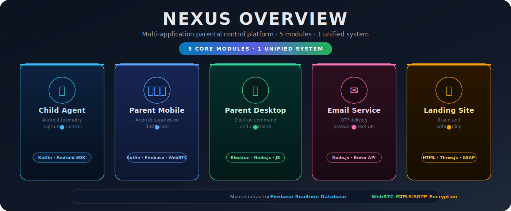
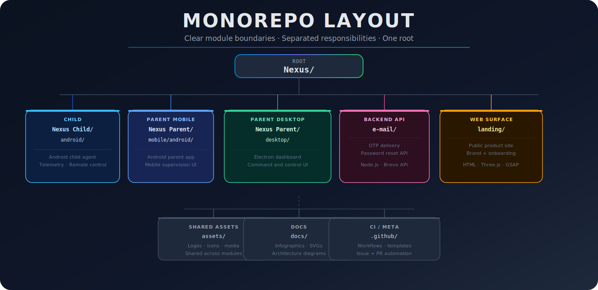
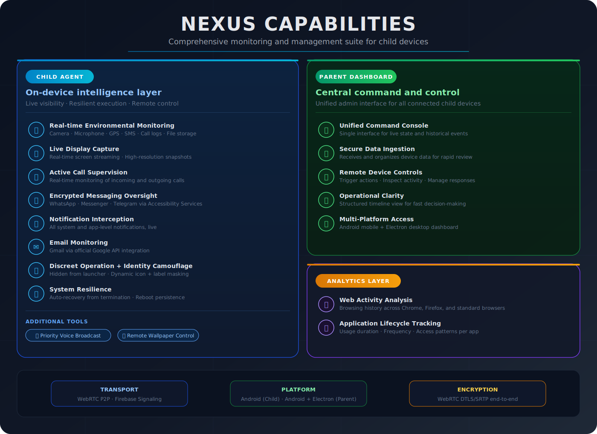
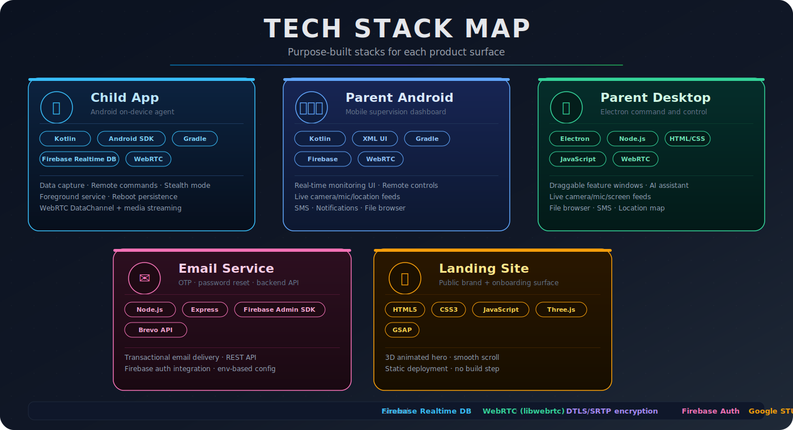
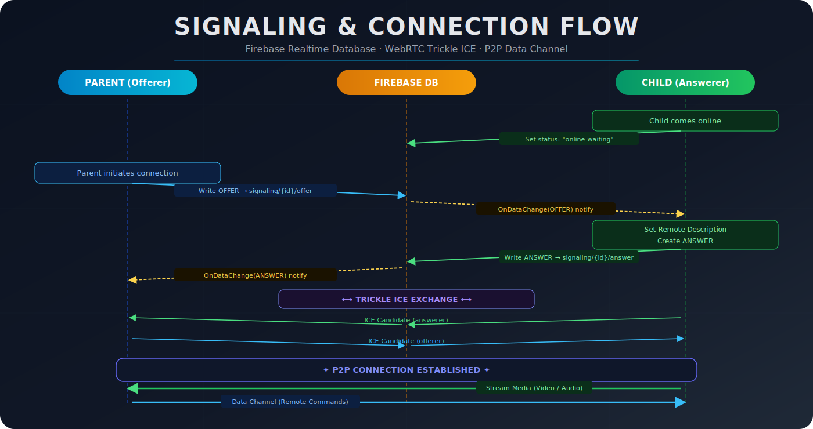
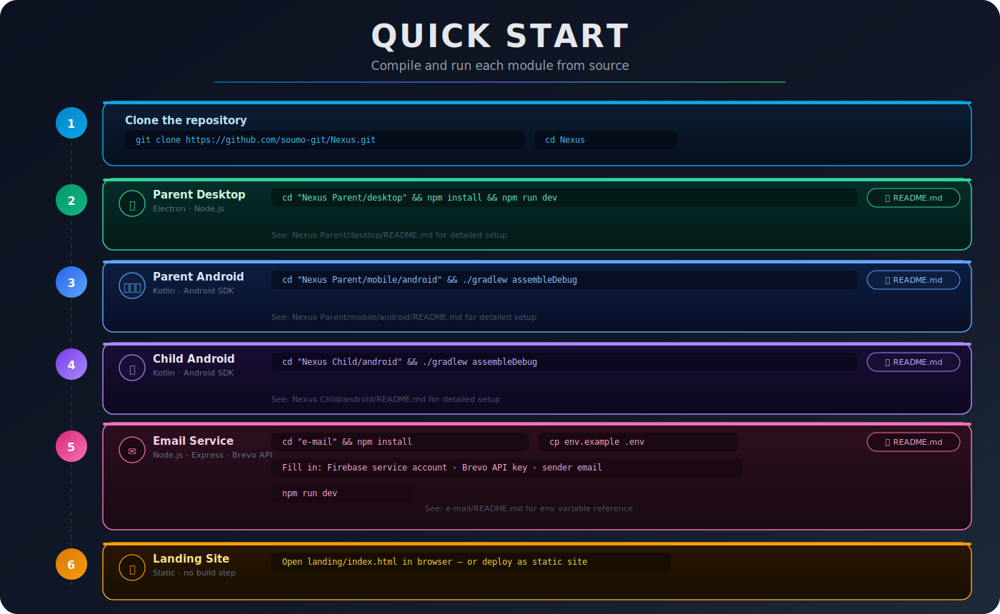



  

<h1 align="center">Nexus</h1>

  <b>Parental Control Platform</b> 
  Child Agent & Parent Dashboards

  
  
  
  
  
  
  

  <a href="#overview"><b>Overview</b></a> •
  <a href="#monorepo-layout"><b>Layout</b></a> •
  <a href="#tech-stack"><b>Tech Stack</b></a> •
  <a href="#quick-start"><b>Quick Start</b></a> •
  <a href="#community"><b>Community</b></a>

  
  
  
  
  
  

### Configuration Notes

* Release history and transparency are tracked in `CHANGELOG.md`.
* `google-services.json` is required in Android modules.
* Email service credentials must be supplied via environment variables.
* Never commit secrets, private keys, or service-account files.

> [!IMPORTANT]
> Nexus must be used only on devices you lawfully own/manage and in compliance with local laws and consent requirements.

---

  <b>Nexus</b> • Responsible parental control tooling

  Maintained by <b>Soumo Mukherjee</b> • <a href="mailto:soumom764@gmail.com">soumom764@gmail.com</a>

  <a href="#top">Back to top</a>

